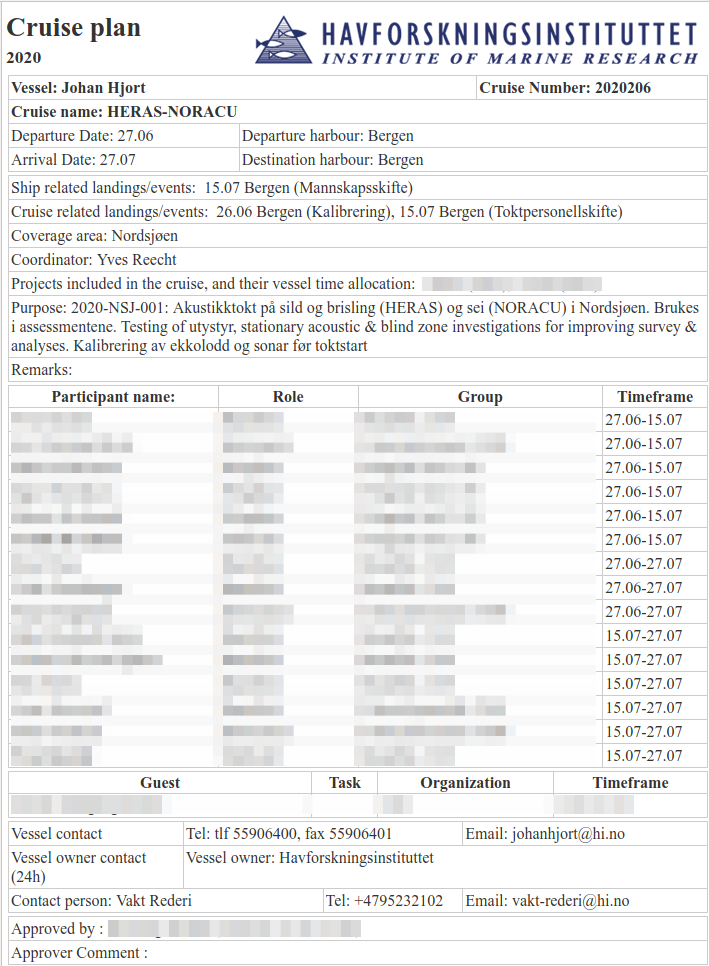

\fontsize{12}{18}
\selectfont

```{r setup, include=FALSE}
knitr::opts_chunk$set(echo = TRUE, dpi = 220, dev = "CairoPNG")
```

```{r, echo=FALSE, message=FALSE}
## Repository path:
RepPath <- "~/Documents/Surveys/2_Survey_data_processing_scripts/HI_survey_tools/"

#Load required packages
Packages <- c("plyr","tidyverse", "data.table", "XML", "reshape2",
              "chron", "proj4", "readxl", "readODS", "Cairo", "bookdown", "pander")
invisible(lapply(X = Packages, FUN = library, character.only = TRUE))

## Specify the location of files in your working directory
test_schema <- file.path(RepPath, "2_Data/Definitions/bioticv3.xsd")
biotic_files <- "<survey_data_path>/BIOLOGY/CATCH_MEASUREMENTS/BIOTIC"
trackPath <- "<survey_data_path>/CRUISE_LOG/TRACK"
acousticsPath <- "<survey_data_path>/ACOUSTIC/LSSS/REPORTS"
CTDpath <- "<survey_data_path>/PHYSICS/CTD/CTD_DATA"

## Load functions:
source(file.path(RepPath, "1_Scripts/0_Functions_biotic_parser.R"))
source(file.path(RepPath, "1_Scripts/0_Functions_graphics.R"))

```

\pagebreak

# Introduction

This is a QC report

## Objectives of the cruise

## Cruise plan and implementation



### Cruise tracks and stations

```{r, echo = FALSE, message=FALSE, results='hide'}

######### Read in data using the functions and plot ########

## biotic_files is the directory for biotic xml files (specified in the beginning)
tokt <- list.files(path=biotic_files, pattern = ".xml", full.names = TRUE)

## Denne lagar tabellar for kvart nivå i biotic data

dd <- parse_biotic(tokt, handlers=biotic_3_handlers, set_data_types=T, schema = test_schema)

## Denne mergar saman stasjonsnivå og fangstnivå i dd-strukturen og legg til fangstratar

stasamp <- right_join(dd$fishstation, dd$catchsample) %>%
    mutate(cr.kg.nm=catchweight/distance) %>%
    mutate(cr.n.nm=catchcount/distance)

## Legg til geartype i tekstformat
stasamp$gear.text <- "Bottom trawl"
stasamp$gear.text[stasamp$gear %in% c("3513", "3514", "3592", "3593")] <- "Pelagic trawl"

stasamp$onRegistration <- stasamp$samplequality == "2"

stasamp$fishingdepthmin[stasamp$fishingdepthmin == 0] <- NA
stasamp$fishingdepthmax[stasamp$fishingdepthmax == 0] <- NA

## median fishing depth per trawl getting rid of obviously wrong (0.0m) fishing depth:
stasamp$fishingdepthmed <- apply(stasamp[ , c("fishingdepthmin", "fishingdepthmax")],
                                 1, median, na.rm = TRUE)
```
`r length(unique(stasamp$station))` trawl hauls were taken during the survey, of which
`r length(unique(stasamp$station[stasamp$gear.text == "Bottom trawl"]))` were bottom trawl,
`r length(unique(stasamp$station[stasamp$gear.text == "Pelagic trawl"]))` pelagic trawl.
<!-- All -->
<!-- `r length(unique(stasamp$station[stasamp$onRegistration]))` trawling stations were coded as "trawling on registration". -->

The trawl hauls covered a total distance of `r round((sum(dd$fishstation$distance)*1852)/1000, digits = 1)` km
(`r round((sum(dd$fishstation$distance)), digits = 1)` nmi).

Cruise tracks from the position log with points indicating start positions for different sampling gear:

```{r, echo=FALSE, message=FALSE, warning=FALSE, fig.width=8, fig.height=6, out.width= "75%", fig.align="center"}
## Get bathymetry data from file
bath1 <- read_csv(file = "./Data/GeoData/ETOPO1_nm4.csv")

## Define map extent and depth contours
Ylim <- c(56, 63)        #latitude
Xlim <- c(-6, 8)         #longitude
xyratio <- 1.5

d.contours <- c(-100, -300, -500)   #Depth contours for plot with bathymetry

## reduce the resolution of depth contours (to increase speed when writing to file)
bath <- subset(bath1, bath1$y>(Ylim[1]-2) & (bath1$y<Ylim[2]+2) &
                      bath1$ x>(Xlim[1]-2)& bath1$x<(Xlim[2]+2) &
                      bath1$z<=(d.contours[1]+1500) & bath1$z>=(d.contours[length(d.contours)]-1500))

## create a list of the position files from the target directory
file_list <- list.files(path = trackPath,
                        pattern = ".csv")

## initiate a blank data frame, each iteration of the loop will append the data from the given file to this variable
dataset <- data.frame()

## set temporary working directory
## setwd("Data/Track")

for (i in 1:length(file_list)){
    temp_data <- fread(file.path(trackPath, file_list[i]),
                       stringsAsFactors = FALSE,
                       header = TRUE, skip = 2, fill = TRUE,
                       strip.white = FALSE) # read in files using the fread function from the data.table package
    temp_data$Date <- strsplit(gsub(".csv", "", file_list[i]),
                                 "s")[[1]][2] # clean the data as needed, in this case I am
                                        # creating a new column that indicates which date each file comes from
    ## The latitude column is in format "DDMM.MMMM N"
    ## The longitude column is in format "0DDMM.MMMM E"
    ## Create new columns with lon and lat in decimal degrees
    temp_data <- temp_data %>% separate(Latitude, into = c("DD", "MM", "x1"),
                                          sep = c(2,10), remove = FALSE) %>%
        separate(Longitude, into = c("DD.lon", "MM.lon", "x2.lon"),
                 sep = c(3,11), remove = FALSE)
    temp_data$DD <- as.numeric(temp_data$DD)
    temp_data$DD.lon <- as.numeric(temp_data$DD.lon)
    temp_data$MM <- as.numeric(temp_data$MM)
    temp_data$MM.lon <- as.numeric(temp_data$MM.lon)
    temp_data$Lat.dd <- (temp_data$DD + temp_data$MM/60) *
        ifelse(grepl("N", temp_data$x1), 1, -1)
    temp_data$Lon.dd <- (temp_data$DD.lon + temp_data$MM.lon/60) *
        ifelse(grepl("E", temp_data$x2.lon), 1, -1)
    dataset <- rbindlist(list(dataset, temp_data), use.names = T, fill = T) # for each iteration, bind the new data to the building dataset
    rm(temp_data)
}

## Name the gears
dataset$gear.text <- NA
dataset$gear.text[dataset$`Station type` == "Bottom trawl start"] <- "Bottom trawl"
dataset$gear.text[dataset$`Station type` == "CTD start"] <- "CTD"
dataset$gear.text[dataset$`Station type` == "Pelagic trawl start"] <- "Pelagic trawl"
## dataset$gear.text[dataset$`Station type` == "Other"] <- "Other"

## For legend order:
dataset$gear.text <- factor(dataset$gear.text,
                            levels = c("Bottom trawl", "Pelagic trawl", "CTD"))

## Plot the cruise tracks and stations
ggplot(bath, aes(x=x, y=y))+
    geom_contour(aes(z=z), breaks=d.contours,
                 colour="lightblue", size=0.4,show.legend = TRUE)+
    geom_contour(aes(z=z), breaks=c(0,1),color="darkgrey", size=.6) +
    geom_point(data=dataset %>% dplyr::filter(is.na(gear.text)),
               aes(Lon.dd, Lat.dd, group = Date),
               alpha=0.25, colour="grey45", size=0.1, inherit.aes = F)+
    geom_point(data = dataset %>% dplyr::filter(!is.na(gear.text)),
               aes(Lon.dd, Lat.dd, color=gear.text, shape = gear.text, size = gear.text),
               inherit.aes = FALSE, stroke = 0.75, width = 0.25)+
    scale_shape_manual(values=c(0, 2, 5))+
    scale_size_manual(values=c(3, 3, 2))+
    scale_color_viridis_d(na.translate=F)+
    theme_bw()+
    coord_fixed(ratio=xyratio, xlim = Xlim,ylim = Ylim)+
    labs(x = "Longitude", y = "Latitude",
         color="Sampling gear", shape = "Sampling gear", size = "Sampling gear")

```
\pagebreak

# Sampling depth for trawl hauls

The sampling stations were located in areas with bottom depths from
`r round(min((stasamp$bottomdepthstart+stasamp$bottomdepthstop)/2), digits =1)` m to
`r round(max((stasamp$bottomdepthstart+stasamp$bottomdepthstop)/2), digits = 1)` m, and the fishing depth
varied from `r round(min(stasamp$fishingdepthmed, na.rm = TRUE), digits=1)` m to
`r round(max(stasamp$fishingdepthmed, na.rm = TRUE), digits=1)` m.

## Mean bottom depth during trawl hauls
```{r, echo=FALSE, message=FALSE, warning=FALSE, fig.width=6, fig.height=2.5, out.width= "70%"}
## Depth at sampled stations - fish
stdat <- dd$fishstation

stdat$gear.text <- "Bottom trawl"
stdat$gear.text[stdat$gear %in% c("3513", "3514", "3592", "3593")] <- "Pelagic trawl"
## stdat$gear.text[stdat$samplequality == "2"] <- "Trawling on registration"

stdat$onRegistration <- stdat$samplequality == "2"

## Bottom depth
ggplot(stdat, aes((bottomdepthstart+bottomdepthstop)/2))+
    geom_histogram(color="black", position = "dodge")+
    labs(x= "Mean bottom depth during trawl haul (m)", y = "Number")+
    facet_wrap(~gear.text)+theme_bw()+
    scale_y_continuous(breaks = c(0,2,4,6,8,10,12))
```

## Mean fishing depth during trawl hauls (excluding pelagic hauls)
```{r, echo=FALSE, message=FALSE, warning=FALSE, fig.width=6, fig.height=3, out.width= "65%"}
## Fishing depth
ggplot(stdat %>% dplyr::filter(!gear.text == "Pelagic trawl"),
       aes((fishingdepthmin+fishingdepthmax)/2, fill = gear.text))+
    geom_histogram(color="black")+
    labs(x= "Mean fishing depth during trawl haul (m)", y = "Number")+
    scale_fill_viridis_d(name = "Gear")+theme_bw()
```

\pagebreak

# Catch rates - biomass and number per nautical mile trawled for species registered in Sea2Data

## Species diversity

```{r,echo=FALSE, message=FALSE}
## Sjekk hvilke arter som er vanligst
tst <- stasamp %>% dplyr::group_by(scientificname) %>%
    dplyr::summarise(meanW=mean(cr.kg.nm), meanN = mean(cr.n.nm),
                     minW = min(cr.kg.nm), maxW = max(cr.kg.nm),
                     minN = min(cr.n.nm), maxN = max(cr.n.nm))
```

A total of `r length(unique(tst$scientificname))` species were registered in Sea2Data during the survey.

### Number of species identified versus the number of stations sampled

```{r, echo = FALSE, message=FALSE, fig.width=3, fig.height=3, out.width= "35%"}
## cumulative number of species vs number of stations

nspec <- data.frame(station=unique(na.omit(stasamp$station)),
                    nspecies=tapply(cumsum(!duplicated(stasamp$scientificname)), stasamp$station,max))

nspec$nstation <- seq(1:nrow(nspec))

ggplot(nspec, aes(nstation, nspecies))+geom_line(size = 1)+theme_bw()+
    labs(x = "Number of stations sampled", y = "Number of unique species identified")
```

\pagebreak

## Average catch rate by species for the 20 species with highest catch rates

### Bottom trawl
```{r,echo=FALSE, message=FALSE, fig.width=9, fig.height=4.3, out.width= "85%", fig.align="center", warning=FALSE}
tst <- stasamp %>% dplyr::group_by(gear.text, scientificname) %>%
    dplyr::summarise(meanW=mean(cr.kg.nm), meanN = mean(cr.n.nm),
                     minW = min(cr.kg.nm), maxW = max(cr.kg.nm),
                     minN = min(cr.n.nm), maxN = max(cr.n.nm))

gear <- "Bottom trawl"

## Weight
ggplot(tst %>% dplyr::filter(gear.text == gear & !is.na(scientificname)),
       aes(reorder(scientificname, -meanW), meanW))+geom_col()+
    ## geom_errorbar(aes(ymin = minW, ymax = maxW))+
    coord_cartesian(xlim =c(1,20))+ #show the 20 species with highest catches
    scale_y_continuous(expand=c(0,0), limits = c(0,max(tst$meanW[tst$gear.text==gear], na.rm=T)+2))+theme_bw()+
    theme(axis.text.x = element_text(angle = 35, colour = "red", size = 11),
          axis.title.x = element_blank())+
    labs(x = "Taxon", y = "Mean catch rate (kg/nmi)", title = "Biomass")

## Number
ggplot(tst %>% dplyr::filter(gear.text == gear & !is.na(scientificname)),
       aes(reorder(scientificname, -meanN), meanN))+geom_col()+
    ## geom_errorbar(aes(ymin = minN, ymax = maxN))+
    coord_cartesian(xlim =c(1,20))+ #show the 20 species with highest catches
    scale_y_continuous(expand=c(0,0), limits = c(0,max(tst$meanN[tst$gear.text==gear], na.rm=T)+15))+#, limits = c(0,700))+
    theme_bw()+theme(axis.text.x = element_text(angle = 35, colour = "red", size = 11), axis.title.x = element_blank())+
    labs(x = "Taxon", y = "Mean catch rate (N/nmi)", title = "Number of individuals")

```

### Pelagic trawl


```{r, echo=FALSE, message=FALSE, fig.width=9, fig.height=4.3, out.width= "85%", fig.align="center", warning=FALSE}
gear <- "Pelagic trawl"

## Weight
ggplot(tst %>% dplyr::filter(gear.text == gear & !is.na(scientificname)),
       aes(reorder(scientificname, -meanW), meanW))+geom_col()+
    ## geom_errorbar(aes(ymin = minW, ymax = maxW))+
    coord_cartesian(xlim =c(1,20))+ #show the 20 species with highest catches
    scale_y_continuous(expand=c(0,0), limits = c(0,max(tst$meanW[tst$gear.text==gear], na.rm=T)+2))+theme_bw()+
    theme(axis.text.x = element_text(angle = 35, colour = "red", size = 11),
          axis.title.x = element_blank())+
    labs(x = "Taxon", y = "Mean catch rate (kg/nmi)", title = "Biomass")

## Number
ggplot(tst %>% dplyr::filter(gear.text == gear & !is.na(scientificname)),
       aes(reorder(scientificname, -meanN), meanN))+geom_col()+
    ## geom_errorbar(aes(ymin = minN, ymax = maxN))+
    coord_cartesian(xlim =c(1,20))+ #show the 20 species with highest catches
    scale_y_continuous(expand=c(0,0), limits = c(0,max(tst$meanN[tst$gear.text==gear], na.rm=T)+15))+#, limits = c(0,700))+
    theme_bw()+theme(axis.text.x = element_text(angle = 35, colour = "red", size = 11), axis.title.x = element_blank())+
    labs(x = "Taxon", y = "Mean catch rate (N/nmi)", title = "Number of individuals")
```

## Spatial variation in catches of common species

For a selection of the most abundant species (substential contribution to integrated acoustic backscatter).

```{R, include=FALSE}
Title.on<-1            #1 for showing chart title, 0 for not showing it
Bubble.size<-6        #Max size of bubbles in bubble plots

Yr <- c(2020)

#coordinates for ship track
coord.track <- dataset %>% dplyr::select(Date,Log, Lon.dd, Lat.dd) %>% data.frame()
```

### Saithe

```{R, echo=FALSE, message=FALSE, fig.width=9, fig.height=4, warning=FALSE, out.width="90%", fig.align="center"}
species <- "Pollachius virens"

Title=ifelse(Title.on==1,paste("Biomass","|",toString(Yr),"|",toString(species)),"")

## Catch rate kg/nmi
ggplot(bath, aes(x=x, y=y))+
    geom_contour(aes(z=z), breaks=d.contours,colour="lightblue", size=0.5,show.legend = TRUE)+
    geom_contour(aes(z=z), breaks=c(0,1),color="darkgrey", size=.6) +
    geom_point(data=coord.track, aes(Lon.dd, Lat.dd, group = Date), alpha=0.1, colour="grey45", size=0.1, inherit.aes = F)+
    geom_point(data=stasamp %>% dplyr::filter(scientificname == species),aes(longitudestart,latitudestart,size = cr.kg.nm),
               shape=21, alpha = 0.7, colour = "black",fill = "orange", stroke = .2)+
    facet_grid(~gear.text)+
    ## geom_path(data=stasamp.map,aes(longitudestart,latitudestart), linejoin="round",lineend="square",alpha=0.4,colour="black",size=0.4)+
    scale_size_area(max_size=Bubble.size)+
    theme_bw()+
    ## coord_fixed(ratio=xyratio, xlim = Xlim,ylim = Ylim)+
    labs(x = NULL, y = NULL, size = "Catch rate (kg/nmi)", title=Title) +
    coord_fixed(ratio=xyratio, xlim = Xlim,ylim = Ylim)

## number catches
Title=ifelse(Title.on==1,paste("Number of individuals","|",toString(Yr),"|",toString(species)),"")

ggplot(bath, aes(x=x, y=y))+
    geom_contour(aes(z=z), breaks=d.contours,colour="lightblue", size=0.5,show.legend = TRUE)+
    geom_contour(aes(z=z), breaks=c(0,1),color="darkgrey", size=.6) +
    geom_point(data=coord.track, aes(Lon.dd, Lat.dd, group = Date), alpha=0.1, colour="grey45", size=0.1, inherit.aes = F)+
    geom_point(data=stasamp %>% dplyr::filter(scientificname == species),
               aes(longitudestart,latitudestart,size = cr.n.nm),
               shape=21, alpha = 0.7, colour = "black",fill = "orange", stroke = .2)+
    facet_grid(~gear.text)+
    ## geom_path(data=stasamp.map,aes(longitudestart,latitudestart), linejoin="round",lineend="square",alpha=0.4,colour="black",size=0.4)+
    scale_size_area(max_size=Bubble.size)+
    theme_bw()+
    coord_fixed(ratio=xyratio, xlim = Xlim,ylim = Ylim)+
    labs(x = NULL, y = NULL, size = "Catch rate (N/nmi)", title=Title)
```

### Haddock

```{r, echo=FALSE, message=FALSE, fig.width=9, fig.height=4, warning=FALSE, out.width="90%", fig.align="center"}
species <- "Melanogrammus aeglefinus"

Title=ifelse(Title.on==1,paste("Biomass","|",toString(Yr),"|",toString(species)),"")

## Catch rate kg/nmi
ggplot(bath, aes(x=x, y=y))+
    geom_contour(aes(z=z), breaks=d.contours,colour="lightblue", size=0.5,show.legend = TRUE)+
    geom_contour(aes(z=z), breaks=c(0,1),color="darkgrey", size=.6) +
    geom_point(data=coord.track, aes(Lon.dd, Lat.dd, group = Date), alpha=0.1, colour="grey45", size=0.1, inherit.aes = F)+
    geom_point(data=stasamp %>% dplyr::filter(scientificname == species),aes(longitudestart,latitudestart,size = cr.kg.nm),
               shape=21, alpha = 0.7, colour = "black",fill = "orange", stroke = .2)+
    facet_grid(~gear.text)+
    ## geom_path(data=stasamp.map,aes(longitudestart,latitudestart), linejoin="round",lineend="square",alpha=0.4,colour="black",size=0.4)+
    scale_size_area(max_size=Bubble.size)+
    theme_bw()+
    coord_fixed(ratio=xyratio, xlim = Xlim,ylim = Ylim)+
    labs(x = NULL, y = NULL, size = "Catch rate (kg/nmi)", title=Title)

## number catches
Title=ifelse(Title.on==1,paste("Number of individuals","|",toString(Yr),"|",toString(species)),"")

ggplot(bath, aes(x=x, y=y))+
    geom_contour(aes(z=z), breaks=d.contours,colour="lightblue", size=0.5,show.legend = TRUE)+
    geom_contour(aes(z=z), breaks=c(0,1),color="darkgrey", size=.6) +
    geom_point(data=coord.track, aes(Lon.dd, Lat.dd, group = Date), alpha=0.1, colour="grey45", size=0.1, inherit.aes = F)+
    geom_point(data=stasamp %>% dplyr::filter(scientificname == species),
               aes(longitudestart,latitudestart,size = cr.n.nm),
               shape=21, alpha = 0.7, colour = "black",fill = "orange", stroke = .2)+
    facet_grid(~gear.text)+
    ## geom_path(data=stasamp.map,aes(longitudestart,latitudestart), linejoin="round",lineend="square",alpha=0.4,colour="black",size=0.4)+
    scale_size_area(max_size=Bubble.size)+
    theme_bw()+
    coord_fixed(ratio=xyratio, xlim = Xlim,ylim = Ylim)+
    labs(x = NULL, y = NULL, size = "Catch rate (N/nmi)", title=Title)
```

### Cod

```{r, echo=FALSE, message=FALSE, fig.width=9, fig.height=4, warning=FALSE, out.width="90%", fig.align="center"}
species <- "Gadus morhua"

Title=ifelse(Title.on==1,paste("Biomass","|",toString(Yr),"|",toString(species)),"")

## Catch rate kg/nmi
ggplot(bath, aes(x=x, y=y))+
    geom_contour(aes(z=z), breaks=d.contours,colour="lightblue", size=0.5,show.legend = TRUE)+
    geom_contour(aes(z=z), breaks=c(0,1),color="darkgrey", size=.6) +
    geom_point(data=coord.track, aes(Lon.dd, Lat.dd, group = Date), alpha=0.1, colour="grey45", size=0.1, inherit.aes = F)+
    geom_point(data=stasamp %>% dplyr::filter(scientificname == species),aes(longitudestart,latitudestart,size = cr.kg.nm),
               shape=21, alpha = 0.7, colour = "black",fill = "orange", stroke = .2)+
    facet_grid(~gear.text)+
    ## geom_path(data=stasamp.map,aes(longitudestart,latitudestart), linejoin="round",lineend="square",alpha=0.4,colour="black",size=0.4)+
    scale_size_area(max_size=Bubble.size)+
    theme_bw()+
    coord_fixed(ratio=xyratio, xlim = Xlim,ylim = Ylim)+
    labs(x = NULL, y = NULL, size = "Catch rate (kg/nmi)", title=Title)

## number catches
Title=ifelse(Title.on==1,paste("Number of individuals","|",toString(Yr),"|",toString(species)),"")

ggplot(bath, aes(x=x, y=y))+
    geom_contour(aes(z=z), breaks=d.contours,colour="lightblue", size=0.5,show.legend = TRUE)+
    geom_contour(aes(z=z), breaks=c(0,1),color="darkgrey", size=.6) +
    geom_point(data=coord.track, aes(Lon.dd, Lat.dd, group = Date), alpha=0.1, colour="grey45", size=0.1, inherit.aes = F)+
    geom_point(data=stasamp %>% dplyr::filter(scientificname == species),
               aes(longitudestart,latitudestart,size = cr.n.nm),
               shape=21, alpha = 0.7, colour = "black",fill = "orange", stroke = .2)+
    facet_grid(~gear.text)+
    ## geom_path(data=stasamp.map,aes(longitudestart,latitudestart), linejoin="round",lineend="square",alpha=0.4,colour="black",size=0.4)+
    scale_size_area(max_size=Bubble.size)+
    theme_bw()+
    coord_fixed(ratio=xyratio, xlim = Xlim,ylim = Ylim)+
    labs(x = NULL, y = NULL, size = "Catch rate (N/nmi)", title=Title)
```

### Blue whiting

```{R, echo=FALSE, message=FALSE, fig.width=9, fig.height=4, warning=FALSE, out.width="90%", fig.align="center"}
species <- "Micromesistius poutassou"

## Title=ifelse(Title.on==1,paste("Biomass","|", toString(Yr),"|",toString(species)),"")

## ## Catch rate kg/nmi
## ggplot(bath, aes(x=x, y=y))+
##   geom_contour(aes(z=z), breaks=d.contours,colour="lightblue", size=0.5,show.legend = TRUE)+
##   geom_contour(aes(z=z), breaks=c(0,1),color="darkgrey", size=.6) + #for coastline only as line, activate this and skip geom_polygon
##   geom_point(data=coord.track, aes(Lon.dd, Lat.dd, group = Date), alpha=0.1,
##              colour="grey45", size=0.1, inherit.aes = F)+
##   geom_point(data=stasamp %>% dplyr::filter(scientificname == species),aes(longitudestart,latitudestart,size = cr.kg.nm),
##              shape=21, alpha = 0.7, colour = "black",fill = "orange", stroke = .2)+
##   facet_grid(~gear.text)+
##  ## geom_path(data=stasamp.map,aes(longitudestart,latitudestart), linejoin="round",lineend="square",alpha=0.4,colour="black",size=0.4)+
##   scale_size_area(max_size=Bubble.size)+
##   theme_bw()+
##   coord_fixed(ratio=xyratio, xlim = Xlim,ylim = Ylim)+
##   labs(x = NULL, y = NULL, size = "Catch rate (kg/nmi)", title=Title)

## ## number catches
## Title=ifelse(Title.on==1,paste("Number of individuals","|",toString(Yr),"|",toString(species)),"")

## ggplot(bath, aes(x=x, y=y))+
##   geom_contour(aes(z=z), breaks=d.contours,colour="lightblue", size=0.5,show.legend = TRUE)+
##   geom_contour(aes(z=z), breaks=c(0,1),color="darkgrey", size=.6) + #for coastline only as line, activate this and skip geom_polygon
##   geom_point(data=coord.track, aes(Lon.dd, Lat.dd, group = Date), alpha=0.1,
##              colour="grey45", size=0.1, inherit.aes = F)+
##   geom_point(data=stasamp %>% dplyr::filter(scientificname == species),
##              aes(longitudestart,latitudestart,size = cr.n.nm),
##              shape=21, alpha = 0.7, colour = "black",fill = "orange", stroke = .2)+
##   facet_grid(~gear.text)+
##   ## geom_path(data=stasamp.map,aes(longitudestart,latitudestart), linejoin="round",lineend="square",alpha=0.4,colour="black",size=0.4)+
##   scale_size_area(max_size=Bubble.size)+
##   theme_bw()+
##   coord_fixed(ratio=xyratio, xlim = Xlim,ylim = Ylim)+
##   labs(x = NULL, y = NULL, size = "Catch rate (N/nmi)", title=Title)
```

### Herring

```{r, echo=FALSE, message=FALSE, fig.width=9, fig.height=4, warning=FALSE, out.width="90%", fig.align="center"}
species <- "Clupea harengus" #for species caught in 2 out of 3 gears (figure size is adjusted)

Title=ifelse(Title.on==1,paste("Biomass","|",toString(Yr),"|",toString(species)),"")

## Catch rate kg/nmi
ggplot(bath, aes(x=x, y=y))+
    geom_contour(aes(z=z), breaks=d.contours,colour="lightblue", size=0.5,show.legend = TRUE)+
    geom_contour(aes(z=z), breaks=c(0,1),color="darkgrey", size=.6) +
    geom_point(data=coord.track, aes(Lon.dd, Lat.dd, group = Date), alpha=0.1, colour="grey45", size=0.1, inherit.aes = F)+
    geom_point(data=stasamp %>% dplyr::filter(scientificname == species),aes(longitudestart,latitudestart,size = cr.kg.nm),
               shape=21, alpha = 0.7, colour = "black",fill = "orange", stroke = .2)+
    facet_grid(~gear.text)+
    ## geom_path(data=stasamp.map,aes(longitudestart,latitudestart), linejoin="round",lineend="square",alpha=0.4,colour="black",size=0.4)+
    scale_size_area(max_size=Bubble.size)+
    theme_bw()+
    coord_fixed(ratio=xyratio, xlim = Xlim,ylim = Ylim)+
    labs(x = NULL, y = NULL, size = "Catch rate (kg/nmi)", title=Title)

## number catches
Title=ifelse(Title.on==1,paste("Number of individuals","|",toString(Yr),"|",toString(species)),"")

ggplot(bath, aes(x=x, y=y))+
    geom_contour(aes(z=z), breaks=d.contours,colour="lightblue", size=0.5,show.legend = TRUE)+
    geom_contour(aes(z=z), breaks=c(0,1),color="darkgrey", size=.6) +
    geom_point(data=coord.track, aes(Lon.dd, Lat.dd, group = Date), alpha=0.1, colour="grey45", size=0.1, inherit.aes = F)+
    geom_point(data=stasamp %>% dplyr::filter(scientificname == species),
               aes(longitudestart,latitudestart,size = cr.n.nm),
               shape=21, alpha = 0.7, colour = "black",fill = "orange", stroke = .2)+
    facet_grid(~gear.text)+
    ## geom_path(data=stasamp.map,aes(longitudestart,latitudestart), linejoin="round",lineend="square",alpha=0.4,colour="black",size=0.4)+
    scale_size_area(max_size=Bubble.size)+
    theme_bw()+
    coord_fixed(ratio=xyratio, xlim = Xlim,ylim = Ylim)+
    labs(x = NULL, y = NULL, size = "Catch rate (N/nmi)", title=Title)
```

### Mackerel

```{r, echo=FALSE, message=FALSE, fig.width=9, fig.height=4, warning=FALSE, out.width="90%", fig.align="center"}
species <- "Scomber scombrus" #for species caught in 2 out of 3 gears (figure size is adjusted)

Title=ifelse(Title.on==1,paste("Biomass","|",toString(Yr),"|",toString(species)),"")

## Catch rate kg/nmi
ggplot(bath, aes(x=x, y=y))+
    geom_contour(aes(z=z), breaks=d.contours,colour="lightblue", size=0.5,show.legend = TRUE)+
    geom_contour(aes(z=z), breaks=c(0,1),color="darkgrey", size=.6) +
    geom_point(data=coord.track, aes(Lon.dd, Lat.dd, group = Date), alpha=0.1, colour="grey45", size=0.1, inherit.aes = F)+
    geom_point(data=stasamp %>% dplyr::filter(scientificname == species),aes(longitudestart,latitudestart,size = cr.kg.nm),
               shape=21, alpha = 0.7, colour = "black",fill = "orange", stroke = .2)+
    facet_grid(~gear.text)+
    ## geom_path(data=stasamp.map,aes(longitudestart,latitudestart), linejoin="round",lineend="square",alpha=0.4,colour="black",size=0.4)+
    scale_size_area(max_size=Bubble.size)+
    theme_bw()+
    coord_fixed(ratio=xyratio, xlim = Xlim,ylim = Ylim)+
    labs(x = NULL, y = NULL, size = "Catch rate (kg/nmi)", title=Title)

## number catches
Title=ifelse(Title.on==1,paste("Number of individuals","|",toString(Yr),"|",toString(species)),"")

ggplot(bath, aes(x=x, y=y))+
    geom_contour(aes(z=z), breaks=d.contours,colour="lightblue", size=0.5,show.legend = TRUE)+
    geom_contour(aes(z=z), breaks=c(0,1),color="darkgrey", size=.6) +
    geom_point(data=coord.track, aes(Lon.dd, Lat.dd, group = Date), alpha=0.1, colour="grey45", size=0.1, inherit.aes = F)+
    geom_point(data=stasamp %>% dplyr::filter(scientificname == species),
               aes(longitudestart,latitudestart,size = cr.n.nm),
               shape=21, alpha = 0.7, colour = "black",fill = "orange", stroke = .2)+
    facet_grid(~gear.text)+
    ## geom_path(data=stasamp.map,aes(longitudestart,latitudestart), linejoin="round",lineend="square",alpha=0.4,colour="black",size=0.4)+
    scale_size_area(max_size=Bubble.size)+
    theme_bw()+
    coord_fixed(ratio=xyratio, xlim = Xlim,ylim = Ylim)+
    labs(x = NULL, y = NULL, size = "Catch rate (N/nmi)", title=Title)
```

### Norway pout

```{r, echo=FALSE, message=FALSE, fig.width=9, fig.height=4, warning=FALSE, out.width="90%", fig.align="center"}
species <- "Trisopterus esmarkii" #for species caught in 2 out of 3 gears (figure size is adjusted)

Title=ifelse(Title.on==1,paste("Biomass","|",toString(Yr),"|",toString(species)),"")

## Catch rate kg/nmi
ggplot(bath, aes(x=x, y=y))+
    geom_contour(aes(z=z), breaks=d.contours,colour="lightblue", size=0.5,show.legend = TRUE)+
    geom_contour(aes(z=z), breaks=c(0,1),color="darkgrey", size=.6) +
    geom_point(data=coord.track, aes(Lon.dd, Lat.dd, group = Date), alpha=0.1, colour="grey45", size=0.1, inherit.aes = F)+
    geom_point(data=stasamp %>% dplyr::filter(scientificname == species),aes(longitudestart,latitudestart,size = cr.kg.nm),
               shape=21, alpha = 0.7, colour = "black",fill = "orange", stroke = .2)+
    facet_grid(~gear.text)+
    ## geom_path(data=stasamp.map,aes(longitudestart,latitudestart), linejoin="round",lineend="square",alpha=0.4,colour="black",size=0.4)+
    scale_size_area(max_size=Bubble.size)+
    theme_bw()+
    coord_fixed(ratio=xyratio, xlim = Xlim,ylim = Ylim)+
    labs(x = NULL, y = NULL, size = "Catch rate (kg/nmi)", title=Title)

## number catches
Title=ifelse(Title.on==1,paste("Number of individuals","|",toString(Yr),"|",toString(species)),"")

ggplot(bath, aes(x=x, y=y))+
    geom_contour(aes(z=z), breaks=d.contours,colour="lightblue", size=0.5,show.legend = TRUE)+
    geom_contour(aes(z=z), breaks=c(0,1),color="darkgrey", size=.6) +
    geom_point(data=coord.track, aes(Lon.dd, Lat.dd, group = Date), alpha=0.1, colour="grey45", size=0.1, inherit.aes = F)+
    geom_point(data=stasamp %>% dplyr::filter(scientificname == species),
               aes(longitudestart,latitudestart,size = cr.n.nm),
               shape=21, alpha = 0.7, colour = "black",fill = "orange", stroke = .2)+
    facet_grid(~gear.text)+
    ## geom_path(data=stasamp.map,aes(longitudestart,latitudestart), linejoin="round",lineend="square",alpha=0.4,colour="black",size=0.4)+
    scale_size_area(max_size=Bubble.size)+
    theme_bw()+
    coord_fixed(ratio=xyratio, xlim = Xlim,ylim = Ylim)+
    labs(x = NULL, y = NULL, size = "Catch rate (N/nmi)", title=Title)
```

<!-- ### Redfish -->

<!-- ```{r, echo=FALSE, message=FALSE, fig.width=9, fig.height=4, warning=FALSE, out.width="90%", fig.align="center"} -->
<!-- species <- c("Sebastes viviparus", "Sebastes mentella", "Sebastes norvegicus") -->
<!-- Title=ifelse(Title.on==1,paste("Biomass","|",toString(Yr),"|","Redfish species"),"") -->

<!-- ## Catch rate kg/nmi -->
<!-- ggplot(bath, aes(x=x, y=y))+ -->
<!--     geom_contour(aes(z=z), breaks=d.contours,colour="lightblue", size=0.5,show.legend = TRUE)+ -->
<!--     geom_contour(aes(z=z), breaks=c(0,1),color="darkgrey", size=.6) + -->
<!--     geom_point(data=coord.track, aes(Lon.dd, Lat.dd, group = Date), alpha=0.1, colour="grey45", size=0.1, inherit.aes = F)+ -->
<!--     geom_jitter(data=stasamp %>% dplyr::filter(scientificname %in% species),aes(longitudestart,latitudestart,size = cr.kg.nm, fill=scientificname), -->
<!--                 shape=21, alpha = 0.8, stroke = .2, color="black")+ -->
<!--     facet_grid(~gear.text)+ -->
<!--     scale_fill_viridis_d(name= "Species", direction = -1)+ -->
<!--     ## geom_path(data=stasamp.map,aes(longitudestart,latitudestart), linejoin="round",lineend="square",alpha=0.4,colour="black",size=0.4)+ -->
<!--     scale_size_area(max_size=Bubble.size)+ -->
<!--     theme_bw()+ -->
<!--     coord_fixed(ratio=xyratio, xlim = Xlim,ylim = Ylim)+ -->
<!--     labs(x = NULL, y = NULL, size = "Catch rate (kg/nmi)", title=Title) -->
<!-- ``` -->

<!-- ```{r, echo=FALSE, message=FALSE, fig.width=9, fig.height=4, warning=FALSE, out.width="90%", fig.align="center"} -->
<!-- ## number catches -->
<!-- Title=ifelse(Title.on==1,paste("Number of individuals","|",toString(Yr),"|","Redfish species"),"") -->

<!-- ggplot(bath, aes(x=x, y=y))+ -->
<!--     geom_contour(aes(z=z), breaks=d.contours,colour="lightblue", size=0.5,show.legend = TRUE)+ -->
<!--     geom_contour(aes(z=z), breaks=c(0,1),color="darkgrey", size=.6) + -->
<!--     geom_point(data=coord.track, aes(Lon.dd, Lat.dd, group = Date), alpha=0.1, colour="grey45", size=0.1, inherit.aes = F)+ -->
<!--     geom_jitter(data=stasamp %>% dplyr::filter(scientificname %in% species), -->
<!--                 aes(longitudestart,latitudestart,size = cr.n.nm, fill=scientificname), -->
<!--                 shape=21, alpha = 0.8, colour = "black", stroke = .2)+ -->
<!--     facet_grid(~gear.text)+ -->
<!--     scale_fill_viridis_d(name="Species", direction = -1)+ -->
<!--     ## geom_path(data=stasamp.map,aes(longitudestart,latitudestart), linejoin="round",lineend="square",alpha=0.4,colour="black",size=0.4)+ -->
<!--     scale_size_area(max_size=Bubble.size)+ -->
<!--     theme_bw()+ -->
<!--     coord_fixed(ratio=xyratio, xlim = Xlim,ylim = Ylim)+ -->
<!--     labs(x = NULL, y = NULL, size = "Catch rate (N/nmi)", title=Title) -->
<!-- ``` -->

## Length distributions

The following figures shows the length distribution of individuals sampled during the survey.

```{r, echo=FALSE, message=FALSE, fig.width=8, fig.height=5.5, out.width= "80%", warning=FALSE}
stasampindi <- right_join(stasamp,dd$individual)
stasampindiage <- tryCatch(left_join(stasampindi, dd$agedetermination),
                           error = function(e)
                  {
                      warning("No age determination!\n",
                              e)
                      return(right_join(stasamp, dd$individual))
                  })

## Kg -> g and m -> cm
stasampindiage$weight.g <- (stasampindiage$individualweight * 1000 )
stasampindiage$length.cm <- (stasampindiage$length * 100 )

## Subset the data depending on measurement precision (largely demersal/pelagic species)
REF5cm <- subset(stasampindiage, commonname %in% c("sei", "torsk", "hyse", "hvitting", "lysing"))
REF1cm <- subset(stasampindiage, commonname %in% c('makrell', "øyepål", "sild'G05", "kolmule", "brisling"))

REF <- rbind(REF5cm, REF1cm)
## head(REF)
## levels(factor(REF$scientificname))

REF$scientificname <- relevel(factor(REF$scientificname), ref = "Clupea harengus")

ggplot(data=REF, aes(x=length.cm)) +
    geom_histogram(breaks=seq(0, 75, by=2), col="black",
                   fill="steelblue", alpha = .6, stroke = 0.25)  +
    labs(title="Histogram of length", x="Length (cm)", y="Count") +
    facet_wrap(~scientificname, scales="free")+theme_bw()

```

<!-- ```{R, echo=FALSE, message=FALSE, fig.width=6, fig.height=5, out.width= "60%", warning=FALSE} -->
<!-- ggplot(data=REF1cm, aes(x=length.cm)) + -->
<!--     geom_histogram(breaks=seq(0, 40, by=1), col="black", fill="steelblue", alpha = .6, stroke = 0.25)  + -->
<!--     labs(title="Histogram of length", x="Length (cm)", y="Count") + -->
<!--     facet_wrap(~scientificname, scales="free")+theme_bw() -->
<!-- ``` -->

## Biological variables

Biological variables were only recorded for saithe, herring and sprat.

### Length-weight relationships

```{r, echo=FALSE, message=FALSE, fig.width=8, fig.height=5, out.width= "100%", warning=FALSE}
REF5cmRed <- subset(stasampindiage, commonname %in% c("sei", "makrell", "sild'G05", "brisling"))
ggplot(REF5cmRed, aes(length.cm, individualweight))+
    geom_point(size = 0.5)+
    facet_wrap(~scientificname, scales = "free")+
    theme_bw()+labs(x = "Length (cm)", y = "Weight (kg)")
```

<!-- ```{r, echo=FALSE, message=FALSE, fig.width=5.5, fig.height=5, out.width= "50%", warning=FALSE} -->
<!-- ggplot(REF1cm, aes(length.cm, weight.g))+ -->
<!--     geom_point(size = 0.5)+ -->
<!--     facet_wrap(~scientificname, scales = "free")+ -->
<!--     theme_bw()+labs(x = "Length (cm)", y = "Weight (g)") -->
<!-- ``` -->
<!-- \pagebreak -->

### Length-age relationships

```{r, echo=FALSE, message=FALSE, fig.width=8, fig.height=5, out.width= "80%", warning=FALSE}
if (! is.null(REF5cmRed$age))
{
    ggplot(REF5cmRed, aes(length.cm, age))+
        geom_point(size = 0.5)+
        facet_wrap(~scientificname, scales = "free")+
        theme_bw()+labs(x = "Length (cm)", y = "Age (years)")
}
```

<!-- ```{r, echo=FALSE, message=FALSE, fig.width=5.5, fig.height=5, out.width= "50%", warning=FALSE} -->
<!-- ggplot(REF1cm, aes(length.cm, age))+ -->
<!--     geom_point(size = 0.5)+ -->
<!--     facet_wrap(~scientificname, scales = "free")+ -->
<!--     theme_bw()+labs(x = "Length (cm)", y = "Age (years)") -->
<!-- ``` -->

### Maturity and spawning

Per sex (recoded but unfiltered). Age and maturity data are jittered for better visualisation of the number of
individuals at similar size or in each combination age-maturity.

```{r, echo=FALSE, message=FALSE, fig.width=8, fig.height=5, out.width= "80%", warning=FALSE}
REF5cmRed$mature <- as.numeric(REF5cmRed$maturationstage) >= 2
REF5cmRed$mature[REF5cmRed$maturationstage == "5"] <- NA
REF5cmRed$spawning <- REF5cmRed$maturationstage == "3"

nMat <- sum(! is.na(REF5cmRed$maturationstage))
nAge <- sum(! is.na(REF5cmRed$age))

idxSex <- as.numeric(REF5cmRed$sex)
idxSex[is.na(idxSex)] <- 5

REF5cmRed$sexRec <- c("1: F", "2: M", "3: transit.", "4: Hemaphr.", "5: NA")[idxSex]

if (nMat > 0)
{
    ggplot(REF5cmRed, aes(length.cm, as.numeric(mature)))+
        geom_jitter(size = 0.5, width = 0.0, height = 0.03)+
        geom_smooth(method = "glm",
                    method.args = list(family = "binomial"),
                    se = FALSE) +
        ggtitle("Maturity vs. size (incl. maturing st. 2)")+
        facet_wrap(~scientificname*sexRec, scales = "free")+
        theme_bw()+labs(x = "Length (cm)", y = "Mature (0/1)")
}
```

```{r, echo=FALSE, message=FALSE, fig.width=8, fig.height=5, out.width= "80%", warning=FALSE}
if (nMat > 0 && nAge> 0)
{
    ggplot(REF5cmRed, aes(age, as.numeric(mature)))+
        geom_jitter(size = 0.5, width = 0.15, height = 0.03)+
        geom_smooth(method = "glm",
                    method.args = list(family = "binomial"),
                    se = FALSE) +
        ggtitle("Maturity vs. age (incl. maturing st. 2)")+
        facet_wrap(~scientificname*sexRec, scales = "free")+
        theme_bw()+labs(x = "Age (y)", y = "Mature (0/1)")
}
```

Spawning individuals:


```{r, echo=FALSE, message=FALSE, fig.width=8, fig.height=5, out.width= "80%", warning=FALSE}
nSpw <- sum(! is.na(REF5cmRed$spawning))

if (nSpw > 0)
{
    ggplot(REF5cmRed, aes(length.cm, as.numeric(spawning)))+
        geom_jitter(size = 0.5, width = 0.15, height = 0.03)+
        geom_smooth(method = "glm",
                    method.args = list(family = "binomial"),
                    se = FALSE) +
        ggtitle("Spawning vs. size")+
        facet_wrap(~scientificname*sexRec, scales = "free")+
        theme_bw()+labs(x = "Length (cm)", y = "Spawning (0/1)")
}
```
```{r, echo=FALSE, message=FALSE, fig.width=8, fig.height=5, out.width= "80%", warning=FALSE}
if (nSpw > 0 && nAge > 0)
{
    ggplot(REF5cmRed, aes(age, as.numeric(spawning)))+
        geom_jitter(size = 0.5, width = 0.15, height = 0.03)+
        geom_smooth(method = "glm",
                    method.args = list(family = "binomial"),
                    se = FALSE) +
        ggtitle("Spawning vs. age")+
        facet_wrap(~scientificname*sexRec, scales = "free")+
        theme_bw()+labs(x = "Age (y)", y = "Spawning (0/1)")
}
```

While maturity is recorded for `r nMat` individuals, it seems that only `r round(100 * nAge / nMat)`% (`r nAge`
individuals) of age readings have been pushed so far in the database. The maturity and spawning ogives based on age are
therefore only preliminary results.

# Acoustic registrations

```{r, echo=FALSE, message=FALSE, warning=FALSE}
### Get acoustic data

## Read in depth-integrated acoustic data from the Acoustic/Integrated directory
dat <- list.files(path = acousticsPath,
                  pattern = "ListUserFile03.*\\.txt", full.names = TRUE)

dat <- dat[order(sapply(dat, file.mtime), decreasing = TRUE)[1]]

acu.dat <- read.csv(dat, header = TRUE)

## Prepare file
acu.year <- as.numeric(substr(acu.dat$DATE,1,5))
acu.dat <- dplyr::select(acu.dat,SHIP,NATION,SURVEY,FREQUENCY,TR,DATE,TIME,LOGSTART,LOGSTOP,LONGITUDE,LATITUDE,DEPTH, c(13:ncol(acu.dat)))
acu.dat <- cbind(acu.dat, acu.year)
acu.dat <- plyr::rename(acu.dat, replace = c("acu.year"="YEAR"))

### Selection variables
Year <- 2020
## format(Sys.time(), "%Y")
Frequency <- c(38000)         #c(3800,120000) c(120000)  - NULL=all frequencies

## Select all species, and the total, and the 38 kHz frequency (in case there are other frequencies in the file)
acu.dat.spec <- select(acu.dat,YEAR,FREQUENCY,LONGITUDE,LATITUDE, c(13:ncol(acu.dat)))
if(is.null(Year)==FALSE)
    acu.dat.map <- acu.dat.spec %>% filter(YEAR %in% Year)
if(is.null(Frequency)==FALSE)
    acu.dat.map <- acu.dat.map %>% filter(FREQUENCY %in% Frequency)

## Melt data so we can plot all acoustic categories in one figure with ggplot
acu.dat.map.melt <- reshape2::melt(acu.dat.map, id.vars = c(1:4))

## Change the names of acoustic categories
levs <- c("PELAG" = "Other pelagic fish",
          "PLANK" = "Plankton",
          "ANSJO" = "Anchovy",
          "SARDP" = "Pilchard",
          "SILD" = "Herring",
          "BRISL" = "Sprat",
          "ODFI" = "Other demersal (no saithe)",
          "TOTAL" = "Total",
          "BUNN" = "Demersal deep (inc. saithe, bl. whiting,...)",
          "BUNN2" = "Demersal shallow (inc. saithe)",
          "SEI" = "Saithe",
          "A/0/S" = "Demersal fish + dense schools (herring,...)")

labls <- c("Demersal deep (inc. saithe, bl. whiting,...)" = 2, "Other pelagic fish" = 4,
           "Plankton" = 4, "Saithe" = 1, "Saithe + dense schools (herring, Nor. pout,...)" = 2,
           "Demersal shallow (inc. saithe)" = 2,
           "Other demersal (no saithe)" = 2, "Pelagic saithe + haddock" = 3, "Total" = 5,
           "Herring" = 1, "Sprat" = 1, "Anchovy" = 2, "Pilchard" = 2,
           "Demersal fish + dense schools (herring,...)" = 4)

acu.dat.map.melt$variable2 <- factor(acu.dat.map.melt$variable,
                                     levels = c(paste(names(acu.dat.map)[5:ncol(acu.dat.map)])),
                                     labels = levs[c(paste(names(acu.dat.map)[5:ncol(acu.dat.map)]))])

acu.dat.map.melt$natOrder <- labls[as.character(acu.dat.map.melt$variable2)]

## unique(acu.dat.map.melt[ , c("variable", "variable2")])
categDescr <- unique(acu.dat.map.melt[ , c("natOrder", "variable", "variable2")]) %>%
    dplyr::filter(variable != "TOTAL") %>%
    dplyr::arrange(natOrder, as.character(variable)) %>%
    plyr::rename(replace = c("variable" = "Category code",
                             "variable2" = "Description")) %>%
    dplyr::select(-natOrder)

row.names(categDescr) <- NULL

panderOptions("table.alignment.default", "left")

## library(xtable)
## head(categDescr)
## print(xtable(categDescr), type = "html")

```

A total of `r round(sum(acu.dat$LOGSTOP-acu.dat$LOGSTAR) * 1.852, digits = 1)` km
(`r round(sum(acu.dat$LOGSTOP-acu.dat$LOGSTAR), digits = 1)` nmi ) of acoustic transects were scrutinized.

<!-- ## Example echograms -->

<!-- {width=8in} -->

<!-- Screenshot from Johan Hjort showing a confirmed capelin school with unusal frequency response, likely caused by emptying of the swim bladder. 06.09.2019, Barents Sea ecosystem survey. Position approximately 76 32 N, 01741 E. LSSS v. 2.6.0. -->

## Depth-integrated acoustic backscatter

Saihe, during the spawning migration season, appears difficult to detect on echograms and seems, in particular, to
trade its usual day-time semi-pelagic behavious for a more benthic-demersal one. The acoustic categorisation relies
therefore mostly on a characterisation of the demersal mix, based on blind trawl stations. in accordance with previous
years, the following categories where used:

`r pander(categDescr, style = 'rmarkdown') `

### Total backscatter

```{r, echo=FALSE, message=FALSE, fig.width=10, fig.height=8, out.width= "100%", warning=FALSE}
### Map area etc
Bubble.size <- 9        # Max size of bubbles in bubble plots

## Plot title
Yr <- sort(unique(acu.dat.map$YEAR))
Fr <- sort(unique(acu.dat.map$FREQUENCY))/1000
Title=ifelse(Title.on==1,paste("Seiakustikk Q1 survey Kristine Bonnevie","|",toString(Yr),"|",toString(Fr),"kHz"), "")

## Plot total acoustic backscatter
ggplot(bath, aes(x=x, y=y))+
    geom_contour(aes(z=z), breaks=d.contours,colour="lightblue", size=0.5,show.legend = TRUE)+
    geom_contour(aes(z=z), breaks=c(0,1),color="darkgrey", size=.6) + #for coastline only as line, activate this and skip geom_polygon
    geom_point(data=acu.dat.map.melt %>% dplyr::filter(variable2 == "Total"),
               aes(LONGITUDE,LATITUDE,size = value),shape=21, alpha = 0.3, colour = "black",fill="orange",stroke = .2)+
    facet_wrap(~variable)+
    geom_path(data=acu.dat.map.melt  %>% dplyr::filter(variable2 == "Total"),
              aes(LONGITUDE,LATITUDE), linejoin="round",lineend="square",alpha=0.4,colour="black",size=0.4)+
    scale_size_area(max_size=Bubble.size## , trans = "sqrt"
                    )+
    theme_bw()+
    coord_fixed(ratio=xyratio, xlim = Xlim,ylim = Ylim)+
    labs(x = NULL, y = NULL, size = "Sa - values", title=Title)
```

\pagebreak

### Demersal species

```{r, echo=FALSE, message=FALSE, fig.width=9, fig.height=9, out.width= "90%", warning=FALSE, fig.align="center"}

demersals <- c("BUNN", "SEI", "A.0.S", "BUNN2", "ODFI")

ggplot(bath, aes(x=x, y=y))+
    geom_contour(aes(z=z), breaks=d.contours,colour="lightblue", size=0.5,show.legend = TRUE)+
    geom_contour(aes(z=z), breaks=c(0,1),color="darkgrey", size=.6) + #for coastline only as line, activate this and skip geom_polygon
    geom_point(data=acu.dat.map.melt %>% dplyr::filter(variable %in% demersals),
               aes(LONGITUDE,LATITUDE,size = value),
               shape=21, alpha = 0.3, colour = "black",fill="orange",stroke = .2)+
    facet_wrap(~variable2, ncol = 2)+
    geom_path(data=acu.dat.map.melt %>% dplyr::filter(variable %in% demersals),
              aes(LONGITUDE,LATITUDE), linejoin="round",
              lineend="square",alpha=0.4,colour="black",size=0.4)+
    scale_size_area(max_size=Bubble.size)+
    theme_bw()+
    coord_fixed(ratio=xyratio, xlim = Xlim,ylim = Ylim)+
    labs(x = NULL, y = NULL, size = "Sa - values", title=Title)

```

### Pelagic species

```{r, echo=FALSE, message=FALSE, fig.width=9, fig.height=6, out.width= "90%", warning=FALSE, fig.align="center"}
## Plot
pelagics <- c("PELAG", "PLANK", "PEL1", "SILD", "BRISL")

ggplot(bath, aes(x=x, y=y))+
    geom_contour(aes(z=z), breaks=d.contours,colour="lightblue", size=0.5,show.legend = TRUE)+
    geom_contour(aes(z=z), breaks=c(0,1),color="darkgrey", size=.6) + #for coastline only as line, activate this and skip geom_polygon
    geom_point(data=acu.dat.map.melt %>% dplyr::filter(variable %in% pelagics),
               aes(LONGITUDE,LATITUDE,size = value),shape=21,
               alpha = 0.3, colour = "black",fill="orange",stroke = .2)+
    facet_wrap(~variable2, ncol = 2)+
    geom_path(data=acu.dat.map.melt  %>% dplyr::filter(variable %in% pelagics),
              aes(LONGITUDE,LATITUDE), linejoin="round",lineend="square", alpha=0.4,colour="black",size=0.4)+
    scale_size_area(max_size=Bubble.size)+
    theme_bw()+
    coord_fixed(ratio=xyratio, xlim = Xlim,ylim = Ylim)+
    labs(x = NULL, y = NULL, size = "Sa - values", title=Title)
```

## Acoustic backscatter in depth channels

### Distance from the surface to weighted depth of acoustic registrations
```{r, echo=FALSE, message=FALSE, fig.width=10, fig.height=3.5, out.width= "100%", warning=FALSE, fig.align="center"}

#### SA resolved in depth channels, plot day night distribution of SA for each species
## in a histogram

## Read in depth-integrated acoustic data from the Acoustic/Integrated directory
dat <- list.files(path = acousticsPath, pattern = "ListUserFile16.*\\.txt", full.names = TRUE)

dat <- dat[order(sapply(dat, file.mtime), decreasing = TRUE)[1]]

acu.ch <- read.table(dat, header=T)

## calculate solar elevation angle for each point

## split time variable into hour, min, sec
times <- colsplit(acu.ch$UTC, pattern = c(":"), names = c("hour", "min", "sec"))
acu.ch.sun <- cbind(acu.ch, times)
acu.ch.sun$hour <- as.numeric(acu.ch.sun$hour)
acu.ch.sun$min <- as.numeric(acu.ch.sun$min)
acu.ch.sun$sec <- as.numeric(acu.ch.sun$min)

## function for calculating solar elevation angle from geographical position and time of day
alt.of.sun <- function(min=x$min, hour=x$hour, day=x$DA, month=x$MO,
                       lat=x$LATITUDE, lon=x$LONGITUD){
  ## altitude of sun
  UTC <- hour + min/60
  CET <- (UTC + 1) %% 24
  dayadd <- cumsum(c(0,31,28,31,30,31,30,31,31,30,31,30,31))
  cumday <- day + dayadd[month]
  K1 <- (lon - 15 - 0.4083 * sin(0.0172 * (cumday-80))
         - 1.7958 * cos(0.0172 * (cumday-80))
         + 2.4875 * sin(0.0344 * (cumday-80)))
  SST <- ((CET*15) + K1) / (180/pi)
  dkl <- asin(0.3979 * sin((0.0172 * (cumday - 80))
                           + 0.03346 * (sin(0.0172 * cumday) - 0.98112)))
  Brq <- lat/(180/pi)
  sinush <- (sin(dkl)*sin(Brq)) - (cos(dkl)*cos(Brq)*cos(SST))
  alt.of.sun <- asin(sinush) * (180/pi)

  ## time when altitude of sun = asun.0
  asun.0 <- 0
  K2 <- (sin(dkl)*sin(Brq) - sin(asun.0/(180/pi))) / (cos(dkl)*cos(Brq))
  K2[K2 < (-1)] <- -1        # polar night
  K2[K2 > ( 1)] <- 1         # midnight sun
  SST0 <- acos(K2)
  CET0 <- (SST0 * (180/pi) - K1) / 15
  UTC0 <- (CET0 - 1) + 24*(CET0 < 1)
  sun.rise <- UTC0%%24
  sun <- data.frame(month, day, hour, min, lon, lat,
                    alt.of.sun, sun.rise)
  return(sun)
}

## do the calculation
x <- acu.ch.sun
sun <- alt.of.sun()
acu.ch.sun <- cbind(acu.ch.sun, sunheight = sun$alt.of.sun, sunrise = sun$sun.rise)

## define day/night observations
acu.ch.sun$TOD <- "Night"
acu.ch.sun$TOD[acu.ch.sun$sunheight-acu.ch.sun$sunrise>0] <- "Day"

## reshape data to long format for plotting
acu.ch.melt <- melt(acu.ch.sun, id.vars = c(1:16,(ncol(acu.ch)+1):ncol(acu.ch.sun)))

## calculate mean depths weighted by SA for each position and category
acu.wmean <- acu.ch.melt %>% dplyr::group_by(LONGITUD, LATITUDE,TOD,BDMIN, BDMAX,
                                             corr.sun = sunheight-sunrise,variable) %>%
    dplyr::summarise(wdepth = weighted.mean(PDMEAN, w = value)) %>% data.frame()

## change category names
acu.wmean$variable2 <- factor(acu.wmean$variable,
                              levels = c(paste(names(acu.ch)[17:ncol(acu.ch)])),
                              labels = levs[c(paste(names(acu.ch)[17:ncol(acu.ch)]))])

## Here is code for two different plots;
## 1) the depth of acoustic registrations - most relevant for species with diel vertical migration, where the light level is proportional to the depth they occupy
## 2) the distance of acoustic registrations to the seafloor, or in cases when the bottom depth is > 600 m, the distance to the maximum scrutinized depth - may be relevant for looking at the depth distribution of demersal species

## Plot histogram of weighted depth of acoustic regitrations by time of day and acoustic category

## pelagic species
ggplot(acu.wmean %>% dplyr::filter(variable %in% pelagics),
       aes(wdepth))+
    geom_histogram(aes(fill=TOD), position="dodge", binwidth = 20)+
    facet_wrap(~variable2)+ coord_flip()+scale_x_continuous(limits=c(0,max(acu.wmean$wdepth, na.rm=T)+20))+
    scale_x_reverse()+
    scale_fill_viridis_d(name="Time of day", direction = -1)+theme_bw()+
    labs(y = "Number of observations (scrutinized nmi)",
         x = "Weighted depth of acoustic backscatter (m)", title = "Pelagic species")
```

\pagebreak

```{r, echo=FALSE, message=FALSE, fig.width=10, fig.height=6.5, out.width= "100%", warning=FALSE, fig.align="center"}
## demersals
ggplot(acu.wmean %>% dplyr::filter(variable %in% demersals),
       aes(wdepth))+geom_histogram(aes(fill=TOD), position="dodge", binwidth = 20)+
    facet_wrap(~variable2)+ coord_flip()+scale_x_continuous(limits=c(0,max(acu.wmean$wdepth, na.rm=T)+20))+
    scale_x_reverse()+
    scale_fill_viridis_d(name="Time of day", direction = -1)+theme_bw()+
    labs(y = "Number of observations (scrutinized nmi)",
         x = "Weighted depth of acoustic backscatter (m)", title = "Demersal species")
```

\pagebreak

### Distance from the seafloor (or max scrutinized depth) to weighted depth of acoustic registrations

```{r, echo=FALSE, message=FALSE, fig.width=10, fig.height=3.5, out.width= "100%", warning=FALSE, fig.align="center"}
ggplot(acu.wmean %>% dplyr::filter(variable %in% pelagics),
       aes(BDMAX-wdepth))+
    geom_histogram(aes(fill=TOD), position="dodge", binwidth = 20)+
    facet_wrap(~variable2) + coord_flip() +
    scale_x_continuous(limits=c(0,max(acu.wmean$BDMAX-acu.wmean$wdepth, na.rm=T)+20)) +
    scale_fill_viridis_d(name="Time of day", direction = -1) + theme_bw()+
    labs(y = "Number of observations (scrutinized nmi)",
         x = "Distance to max scutinized depth (m)", title = "Pelagic species")
```

\pagebreak
```{r, echo=FALSE, message=FALSE, fig.width=10, fig.height=6.5, out.width= "100%", warning=FALSE, fig.align="center"}
ggplot(acu.wmean %>% dplyr::filter(variable %in% demersals),
       aes(BDMAX-wdepth))+
    geom_histogram(aes(fill=TOD), position="dodge", binwidth = 20)+
    facet_wrap(~variable2) + coord_flip() +
    scale_x_continuous(limits=c(0,max(acu.wmean$BDMAX-acu.wmean$wdepth, na.rm=T)+20)) +
    scale_fill_viridis_d(name="Time of day", direction = -1) + theme_bw()+
    labs(y = "Number of observations (scrutinized nmi)",
         x = "Distance to max scutinized depth (m)", title = "Demersal species")
```

\pagebreak

# CTD
```{r, echo=FALSE, message=FALSE}
## create a list of the files from your target directory
file_list <- list.files(path = CTDpath,  pattern = "sta[[:digit:]]+.cnv", full.names = TRUE, ignore.case = TRUE)

## set temporary working directory
## setwd("Data/CTD")

## initiate a blank data frame, each iteration of the loop will append the data from the given file to this variable
ctd <- data.frame()

for (i in 1:length(file_list))
{
    ## Find the end of headings:
    tmp <- readLines(con = file_list[i], n = 500)

    temp_data <- fread(file_list[i], stringsAsFactors = FALSE, header = FALSE,
                       skip = grep("*END*", tmp)) #read in files using the fread function from the data.table package
    names(temp_data) <- c("scan_count", "pressure_db", "temperature", "temperature_2",
                          "conductivity", "conductivity_2", "oxygen_raw", "altimeter",
                          "par_irradiance", "surface_irradiance", "corrected_irradiance",
                          "oxygen_ml_l", "salinity_PSU", "salinity_PSU2",
                          "density", "sound_velocity",
                          "sound_velocity_av", "flag")
    ## select the measurements from when the CTD was descending
    temp_data <- temp_data[1:which.max(temp_data$pressure_db),]
    ## Create a station variable from the file name
    temp_data$station <- gsub("sta([[:digit:]]+)\\.cnv", "\\1",
                              basename(file_list[i]), ignore.case = TRUE)
    ctd <- rbindlist(list(ctd, temp_data), use.names = TRUE) #for each iteration, bind the new data to the building dataset
    rm(temp_data)
}

## position of stations is in data.frame called dataset from the cruise log

ctdpos <- subset(dataset, grepl("CTD", `Station type`)) %>%
    dplyr::select(Loc.St.No,Time,Date, Lon.dd, Lat.dd) %>%
    dplyr::rename(station = Loc.St.No) %>% dplyr::filter(!is.na(station)) %>%
    dplyr::arrange(station) %>% data.frame()
ctdpos$station <- as.character(ctdpos$station)
ctdpos <- ctdpos %>% dplyr::group_by(station) %>%
    dplyr::summarise(Lon = mean(Lon.dd),Lat = mean(Lat.dd), Time = unique(Time)[1],
                     Date = unique(Date)[1])
ctdpos$station <- paste0("0",ctdpos$station)
ctd <- left_join(ctd, ctdpos)

maxdepth <- ctd %>% dplyr::group_by(station, Lon, Lat) %>%
    dplyr::summarise(max_depth = max(pressure_db, na.rm = TRUE))
ctd <- left_join(ctd, maxdepth)
ctd$plotdepth <- NA
ctd$plotdepth[ctd$pressure_db<=50] <- "Surface"
ctd$plotdepth[ctd$max_depth-ctd$pressure_db<=50] <- "Bottom"

## If the depth is <= 50 m, the surface layer will be overwritten by the bottom layer in the command above. Therefore add an extra line with the same temperature for surface.
for(i in 1:nrow(ctd)){
    if(ctd$max_depth[i]<=51){
        extra <- ctd[i,]
        extra$plotdepth <- "Surface"
        ctd <- rbind(ctd, extra)
    }
}

ctd.plot <- ctd %>% dplyr::group_by(station, Lon, Lat, Date, Time, plotdepth, max_depth) %>%
    dplyr::summarise(mean_temp = mean(temperature, na.rm = TRUE),
                     mean_salinity = mean(salinity_PSU, na.rm = TRUE)) %>%
    dplyr::filter(!is.na(plotdepth)) %>%
    data.frame()

```
## Summary of measurements

`r length(unique(ctd$station))` CTD casts were done during the survey, covering a total depth of `r round(sum(maxdepth$max_depth)/1000, digits = 1)` km.

```{r, echo=FALSE, fig.height=3, fig.width=4.5, out.width= "40%",fig.show="hold", message=FALSE, warning=FALSE}

ggplot(ctd, aes(temperature))+geom_histogram(color="black")+theme_bw()+
    labs(x = "Temperature (deg C)", y = "Count")

ggplot(ctd, aes(salinity_PSU))+geom_histogram(color="black")+theme_bw()+
    labs(x = "Salinity (PSU)", y = "Count")
```

\pagebreak

## Variation in temperature and salinity with bathymetry and geographical location

```{r, echo=FALSE, message=FALSE, fig.width=9, fig.height=4, out.width= "100%", warning=FALSE, fig.align="center"}

ggplot(bath, aes(x=x, y=y))+
    geom_contour(aes(z=z), breaks=d.contours,colour="lightblue", size=0.5,show.legend = TRUE)+
    geom_contour(aes(z=z), breaks=c(0,1),color="darkgrey", size=.6) +
    geom_point(data=coord.track, aes(Lon.dd, Lat.dd, group = Date),
               alpha=0.1, colour="grey45", size=0.1, inherit.aes = FALSE)+
    geom_point(data=ctd.plot, aes(Lon, Lat, fill = mean_temp),
               size = 4, color="black", shape = 21)+
    facet_wrap(~plotdepth)+
    scale_fill_distiller(palette="RdYlBu")+
    theme_bw()+
    coord_fixed(ratio=xyratio, xlim = Xlim,ylim = Ylim)+
    labs(x = "Longitude", y = "Latitude", fill="Mean temperature (deg C)")
```

```{r, echo=FALSE, message=FALSE, fig.width=9, fig.height=4, out.width= "100%", warning=FALSE, fig.align="center"}

ggplot(bath, aes(x=x, y=y))+
  geom_contour(aes(z=z), breaks=d.contours,colour="lightblue", size=0.5,show.legend = TRUE)+
  geom_contour(aes(z=z), breaks=c(0,1),color="darkgrey", size=.6) +
 geom_point(data=coord.track, aes(Lon.dd, Lat.dd, group = Date), alpha=0.1, colour="grey45", size=0.1, inherit.aes = F)+
  geom_point(data=ctd.plot, aes(Lon, Lat, fill = mean_salinity), size = 4, color="black", shape = 21)+
  facet_wrap(~plotdepth)+
  scale_fill_distiller(palette="BuPu", trans = "reverse", guide = guide_colorbar(reverse = T))+
  theme_bw()+
  coord_fixed(ratio=xyratio, xlim = Xlim,ylim = Ylim)+
  labs(x = "Longitude", y = "Latitude", fill="Mean salinity (PSU)")
```

\pagebreak

## Density in the water column

```{r, echo=FALSE, message=FALSE, fig.width=9, fig.height=2.8, warning=FALSE, fig.align="center"}

depthlim <- 350 #choose the maximum depth you want to plot

ggplot(ctd, aes(density, pressure_db, group=station, color=Lat))+
    geom_line(size = 0.55)+
    scale_y_reverse(limits=c(depthlim,0))+
    scale_color_distiller(palette="Spectral")+
    ## scale_color_viridis_c(option = "A")+
    labs(x = expression("Density (sigma-t, kg/"*m^3*")"),
         y = "Depth (m)", color="Latitude (N)")+
    theme_bw()+theme(panel.background = element_rect(fill="black"),
                     panel.grid.major = element_line(color = "grey45", size = 0.1, linetype=1),
                     panel.grid.minor = element_blank())

ggplot(ctd, aes(density, pressure_db, group=station, color=Lon))+
    geom_line(size = 0.55)+
    scale_y_reverse(limits=c(depthlim,0))+
    scale_color_distiller(palette="Spectral")+
    ## scale_color_viridis_c(option = "A")+
    labs(x = expression("Density (sigma-t, kg/"*m^3*")"),
         y = "Depth (m)", color="Longitude (E)")+
    theme_bw()+theme(panel.background = element_rect(fill="black"),
                     panel.grid.major = element_line(color = "grey45", size = 0.1, linetype=1),
                     panel.grid.minor = element_blank())
```

\pagebreak

## Light in the water column

```{r, echo=FALSE, message=FALSE, fig.width=9, fig.height=4, warning=FALSE, fig.align="center"}

tst <- strptime(ctd$Time, format = "%H:%M:%S")
tt1 <- chron::times(format(tst, "%H:%M:%S"))
ctd$timetest <- tt1

ctd$newtime <- hours(ctd$timetest)

ggplot(ctd, aes(par_irradiance, pressure_db, group=station, color=newtime))+
    geom_line(size = 0.55)+
    scale_y_reverse(limits=c(depthlim,0))+
    scale_color_distiller(palette="Spectral")+
    ## scale_color_viridis_c(option = "A")+
    labs(x = expression("PAR irradiance ("*mu*"E/"*m^2*"s"*")"),
         y = "Depth (m)", color="Time of day (h)")+
    theme_bw()+theme(panel.background = element_rect(fill="black"),
                     panel.grid.major = element_line(color = "grey45", size = 0.1, linetype=1),
                     panel.grid.minor = element_blank())

```
